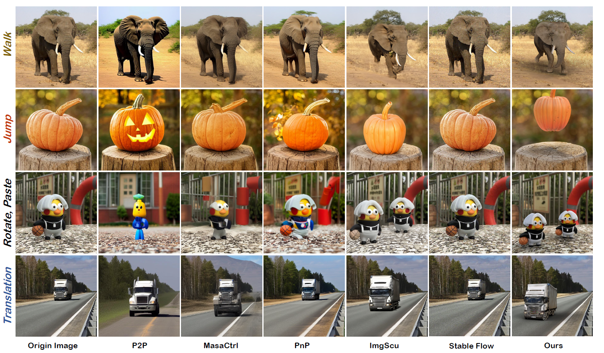
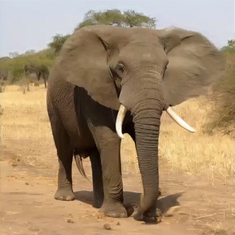

<h1 align="center"><strong>OMINI: Unlocking Object Manipulation in a Single Image</strong></h1>

<b>Applications of OMINI.</b>

<!-- 第一行：四个 GIF -->

| |  | | |
|:---------------------------:|:----------------------------:|:----------------------------:|:---------------------------:|

<!-- 第二行：三张 GIF 居中，两侧空单元格保持等宽 -->
| |  |  | |
|:---------------------------:|:----------------------------:|:----------------------------:|:---------------------------:|

<section class="section hero is-light is-small">
  

    <!-- Abstract. -->
    

      

        <h2 align="center" class="title is-3">Abstract</h2>
        

          

            Unlocking versatile object manipulation—from appearance editing to full animation—directly from a static image remains a challenging problem. Existing methods often struggle to simultaneously support both visual modification and realistic animation, while also falling short in preserving object fidelity and realistic scene illumination. In this work, we introduce OMINI, a unified framework that addresses these challenges through two complementary strategies. First, to support both static editing and dynamic animation, OMINI operates directly on 3D object geometry thereby sharing a unified representation across tasks, enabling consistent appearance under varying poses and motions during manipulation. Second, to improve fidelity in both object appearance and scene illumination, we incorporate two dedicated modules: CGTRefiner, which refines rendered views using a concept-specific diffusion model and optimizes the UV texture map via differentiable rasterization; and IHLCorrector, which adjusts estimated lighting based on object-level color priors to enhance realism. Extensive experiments demonstrate that OMINI achieves superior performance in both static and dynamic settings, producing high-quality and visually consistent results. Notably, the entire pipeline operates efficiently on a single NVIDIA RTX 3090 GPU. Code and models will be released upon paper acceptance.
          

        

      

    

    
</section>

<b>Model structure of our model, OMINI.</b>

  

<b>Comparison with other image edit methods.</b>

  

<b>Comparison with other image animation methods.</b>

<table align="center">
  <tr>
    

      
        Text Description: An elephant is walking on the ground.
      
    

    <td align="center" style="width: 33.33%;">
       
      
By Pika

    </td>
    <td align="center" style="width: 33.33%;">
       
      
By DynamiCrafter

    </td>
    <td align="center" style="width: 33.33%;">
       
      
CogVideoX

    </td>
  </tr>
  <td align="center" style="width: 33.33%;">
     
    
By Wan

  </td>
  <td align="center" style="width: 33.33%;">
     
    
By ImgScu

  </td>
  <td align="center" style="width: 33.33%;">
     
    
Ours

  </td>
</table>

<table align="center">
  <tr>
    

      
        Text Description: A boxtoy greets and waves its hand.
      
    

    <td align="center" style="width: 33.33%;">
       
      
By Pika

    </td>
    <td align="center" style="width: 33.33%;">
       
      
By DynamiCrafter

    </td>
    <td align="center" style="width: 33.33%;">
       
      
CogVideoX

    </td>
  </tr>
  <td align="center" style="width: 33.33%;">
     
    
By Wan

  </td>
  <td align="center" style="width: 33.33%;">
     
    
By ImgScu

  </td>
  <td align="center" style="width: 33.33%;">
     
    
Ours

  </td>
</table>

<table align="center">
  <tr>
    

      
        Text Description: A woodenman sits and cheers.
      
    

    <td align="center" style="width: 33.33%;">
       
      
By Pika

    </td>
    <td align="center" style="width: 33.33%;">
       
      
By DynamiCrafter

    </td>
    <td align="center" style="width: 33.33%;">
       
      
CogVideoX

    </td>
  </tr>
  <td align="center" style="width: 33.33%;">
     
    
By Wan

  </td>
  <td align="center" style="width: 33.33%;">
     
    
By ImgScu

  </td>
  <td align="center" style="width: 33.33%;">
     
    
Ours

  </td>
</table>

<table align="center">
  <tr>
    

      
        Text Description: A rotated pumpkin jumps on a stump.
      
    

    <td align="center" style="width: 33.33%;">
       
      
By Pika

    </td>
    <td align="center" style="width: 33.33%;">
       
      
By DynamiCrafter

    </td>
    <td align="center" style="width: 33.33%;">
       
      
CogVideoX

    </td>
  </tr>
  <td align="center" style="width: 33.33%;">
     
    
By Wan

  </td>
  <td align="center" style="width: 33.33%;">
     
    
By ImgScu

  </td>
  <td align="center" style="width: 33.33%;">
     
    
Ours

  </td>
</table>

