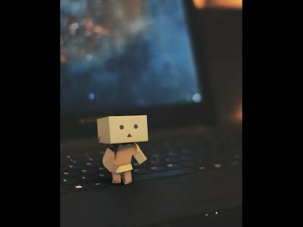
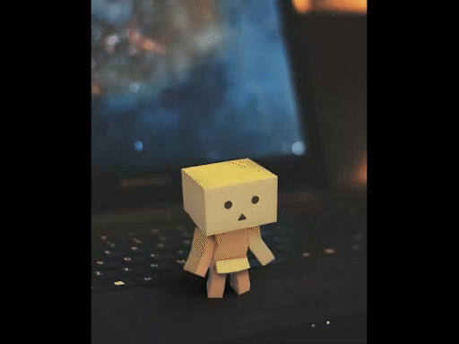
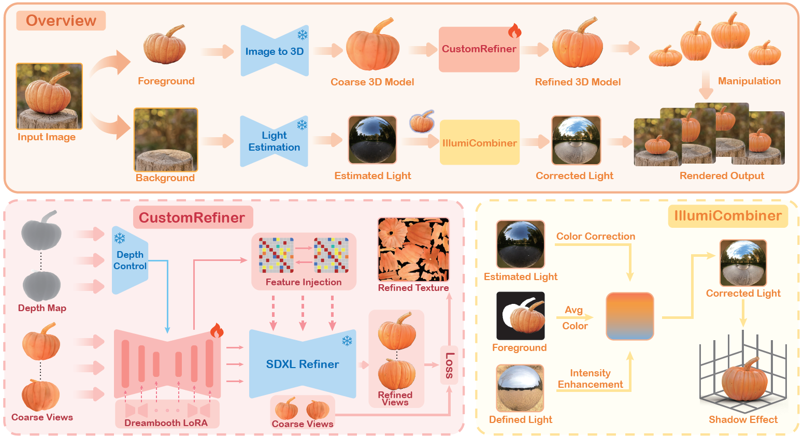
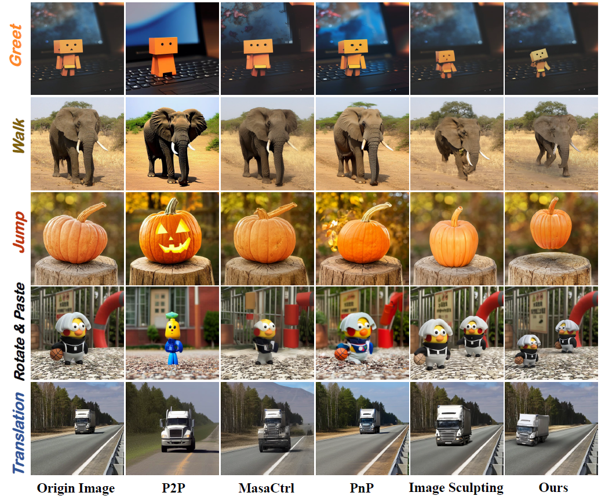
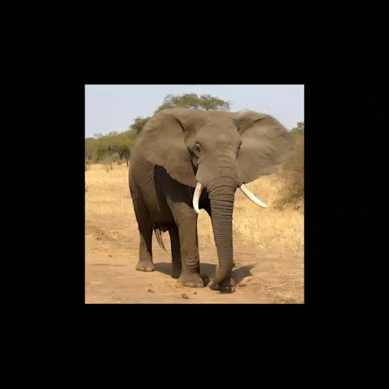
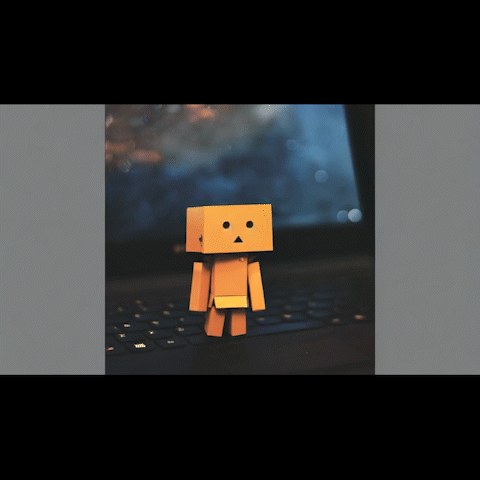

<h1 align="center"><strong>OMG3D: 3D Object Manipulation in a Single Image Using Generative Models</strong></h1>

<!-- 
|  |  |  |  |  |
|-----------------------------|----------------------------|----------------------------|----------------------------|----------------------------| -->

<!-- 第一行：显示四个 GIF -->
<!-- |  |  |  |  |
|-----------------------------|----------------------------|----------------------------|----------------------------|

|                           |                     |                     |
|:----------------------------------:|:----------------------------------:|:----------------------------------:| -->

<!-- 第一行：四个 GIF -->
|  |  |  |  |
|-----------------------------|----------------------------|----------------------------|----------------------------|

<!-- 第二行：三张 GIF 居中，两侧空单元格保持等宽 -->
|                             |  |  |  |
|:---------------------------:|:----------------------------:|:----------------------------:|:---------------------------:|

<b>Applications of OMG3D.</b>

<section class="section hero is-light is-small">
  

    <!-- Abstract. -->
    

      

        <h2 align="center" class="title is-3">Abstract</h2>
        

          

            Object manipulation in images aims to not only edit the object presentation but 
            also gift objects with motion. Previous methods encountered challenges in concurrently 
            handling static editing and dynamic motion applications, while also struggling to 
            achieve realism in object appearance and scene lighting. In this work, we introduce OMG3D, 
            a novel framework that integrates the precise geometric control with the generative power 
            of diffusion models, thus achieving significant enhancements in visual performance. 
            Our framework converts 2D objects into 3D, enabling user-directed modifications and 
            lifelike motions at the geometric level. To address texture realism, we propose CustomRefiner, 
            a texture refinement module that pretrain a customized diffusion model to align the 
            style and perspectives of coarse renderings with the original image. Additionally, 
            we introduce IllumiCombiner, an lighting processing module that estimates and adjusts 
            background lighting to match human visual perception, resulting in more realistic 
            illumination. Extensive experiments demonstrate the outstanding visual performance of
            our approach in both static and dynamic scenarios. Remarkably, all these steps
            can be done using one NVIDIA 3090. The code and project page will be released
            upon acceptance of the paper.
          

        

      

    

    
</section>

<!-- 

<b>Model structure of our model, OMG3D.</b>

<b>Comparison with other image edit methods. </b>

 -->

<b>Model structure of our model, OMG3D.</b>

  

<b>Comparison with other image edit methods.</b>

  

Text Description: A rotated pumpkin jumping on a stump.

<table>
  <!-- 第一行 -->
  <tr>
  <td align="center" style="width: 33.33%;">
     
    
By DynamiCrafter

  </td>
  <td align="center" style="width: 33.33%;">
     
    
By Image Sculpting

  </td>
  <td align="center" style="width: 33.33%;">
     
    
Ours

  </td>
</tr>

<!-- 第二行 -->
<tr>
  <td colspan="3" align="center">
    

      

         
        
By Pika Video Model

      

      

         
        
By SVD

      

    

  </td>
</tr>

</table>

 
Text Description: An elephant is walking on the ground.

<table align="center">
  <!-- 第一行 -->
   <tr>
  <td align="center" style="width: 33.33%;">
     
    
By DynamiCrafter

  </td>
  <td align="center" style="width: 33.33%;">
     
    
By Image Sculpting

  </td>
  <td align="center" style="width: 33.33%;">
     
    
Ours

  </td>
</tr>

<!-- 第二行 -->
<tr>
  <td colspan="3" align="center">
    

      

         
        
By Pika Video Model

      

      

         
        
By SVD

      

    

  </td>
</tr>
</table>

 
Text Description: A boxtoy greeting on the keyboard.

<table align="center">
  <!-- 第一行 -->
   <tr>
  <td align="center" style="width: 33.33%;">
     
    
By DynamiCrafter

  </td>
  <td align="center" style="width: 33.33%;">
     
    
By Image Sculpting

  </td>
  <td align="center" style="width: 33.33%;">
     
    
Ours

  </td>
</tr>

<!-- 第二行 -->
<tr>
  <td colspan="3" align="center">
    

      

         
        
By Pika Video Model

      

      

         
        
By SVD

      

    

  </td>
</tr>
  </tr>
</table>

 

<b>Comparison with other image animation methods.</b>

