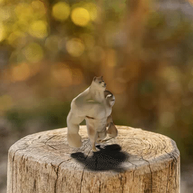
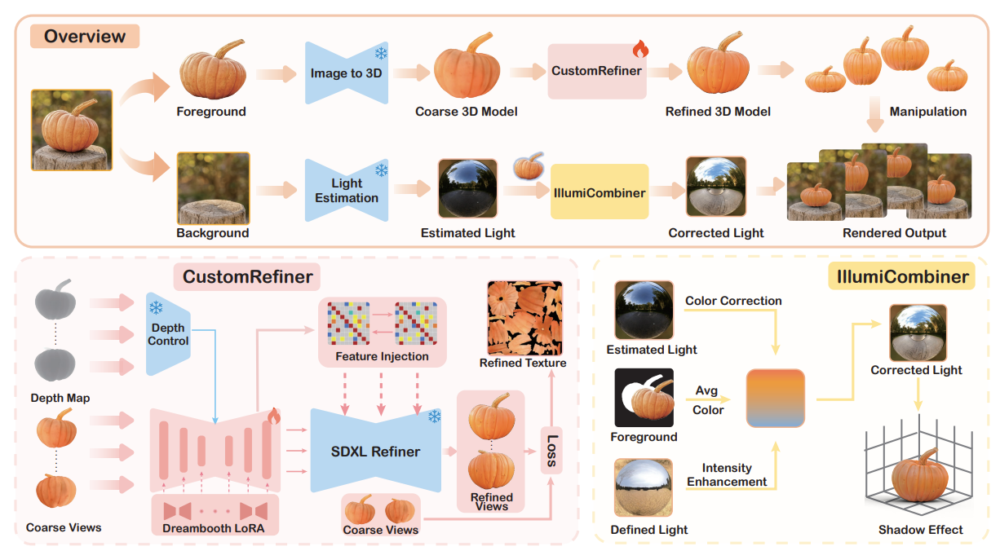
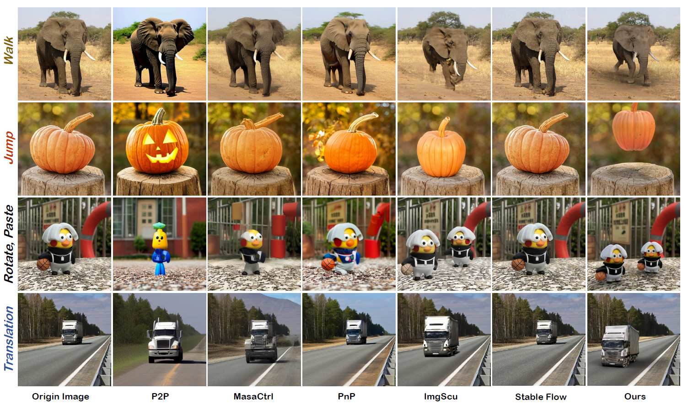
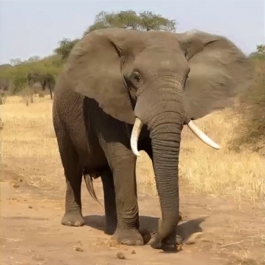
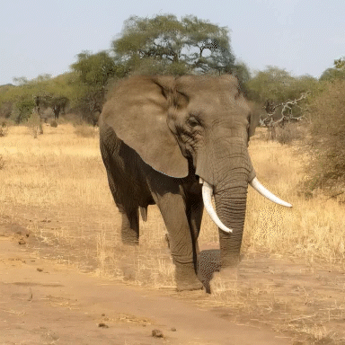

<h1 align="center"><strong>3D Object Manipulation in a Single Image Using Generative Models</strong></h1>

<b>Applications of OMG3D.</b>

<!-- 第一行：四个 GIF -->

| |  | | |
|:---------------------------:|:----------------------------:|:----------------------------:|:---------------------------:|

<!-- 第二行：三张 GIF 居中，两侧空单元格保持等宽 -->
| |  |  | |
|:---------------------------:|:----------------------------:|:----------------------------:|:---------------------------:|

<section class="section hero is-light is-small">
  

    <!-- Abstract. -->
    

      

        <h2 align="center" class="title is-3">Abstract</h2>
        

          

            Object manipulation in images aims not only to edit the 
            object appearances but also to animate objects. Previous
            methods faced challenges in simultaneously handling static
            editing and dynamic generation, while also struggling to
            achieve fidelity in object appearance and scene lighting.
            In this work, we introduce OMG3D, a novel framework
            that combines precise geometric control with the generative 
            power of diffusion models, thus achieving significant
            improvements in visual performance. Our framework first
            converts 2D objects into 3D, enabling user-directed modifications
            and lifelike motion at the geometric level. To
            address texture realism, we propose CustomRefiner, a texture
            refinement module that pre-trains a customized diffusion model, 
            aligning the details and style of coarse renderings from the
            rough 3D model with the original image, further refining the texture.
            Additionally, we introduce IllumiCombiner, a lighting processing module
            that estimates and corrects background lighting to match human visual
            perception, resulting in more realistic shadow effects. Extensive
            experiments demonstrate the outstanding visual performance of 
            our approach in both static and dynamic scenarios. Remarkably, 
            all of these steps can be executed on a single NVIDIA 3090. The
            code and project will be released upon the acceptance of the paper.
          

        

      

    

    
</section>

<b>Model structure of our model, OMG3D.</b>

  

<b>Comparison with other image edit methods.</b>

  

<b>Comparison with other image animation methods.</b>

<table align="center">
  <tr>
    

      
        Text Description: An elephant is walking on the ground.
      
    

    <td align="center" style="width: 33.33%;">
       
      
By Pika

    </td>
    <td align="center" style="width: 33.33%;">
       
      
By DynamiCrafter

    </td>
    <td align="center" style="width: 33.33%;">
       
      
CogVideoX

    </td>
  </tr>
  <td align="center" style="width: 33.33%;">
     
    
By Wan

  </td>
  <td align="center" style="width: 33.33%;">
     
    
By ImgScu

  </td>
  <td align="center" style="width: 33.33%;">
     
    
Ours

  </td>
</table>

<table align="center">
  <tr>
    

      
        Text Description: A boxtoy greets and waves its hand.
      
    

    <td align="center" style="width: 33.33%;">
       
      
By Pika

    </td>
    <td align="center" style="width: 33.33%;">
       
      
By DynamiCrafter

    </td>
    <td align="center" style="width: 33.33%;">
       
      
CogVideoX

    </td>
  </tr>
  <td align="center" style="width: 33.33%;">
     
    
By Wan

  </td>
  <td align="center" style="width: 33.33%;">
     
    
By ImgScu

  </td>
  <td align="center" style="width: 33.33%;">
     
    
Ours

  </td>
</table>

<table align="center">
  <tr>
    

      
        Text Description: A woodenman sits and cheers.
      
    

    <td align="center" style="width: 33.33%;">
       
      
By Pika

    </td>
    <td align="center" style="width: 33.33%;">
       
      
By DynamiCrafter

    </td>
    <td align="center" style="width: 33.33%;">
       
      
CogVideoX

    </td>
  </tr>
  <td align="center" style="width: 33.33%;">
     
    
By Wan

  </td>
  <td align="center" style="width: 33.33%;">
     
    
By ImgScu

  </td>
  <td align="center" style="width: 33.33%;">
     
    
Ours

  </td>
</table>

<table align="center">
  <tr>
    

      
        Text Description: A rotated pumpkin jumps on a stump.
      
    

    <td align="center" style="width: 33.33%;">
       
      
By Pika

    </td>
    <td align="center" style="width: 33.33%;">
       
      
By DynamiCrafter

    </td>
    <td align="center" style="width: 33.33%;">
       
      
CogVideoX

    </td>
  </tr>
  <td align="center" style="width: 33.33%;">
     
    
By Wan

  </td>
  <td align="center" style="width: 33.33%;">
     
    
By ImgScu

  </td>
  <td align="center" style="width: 33.33%;">
     
    
Ours

  </td>
</table>

